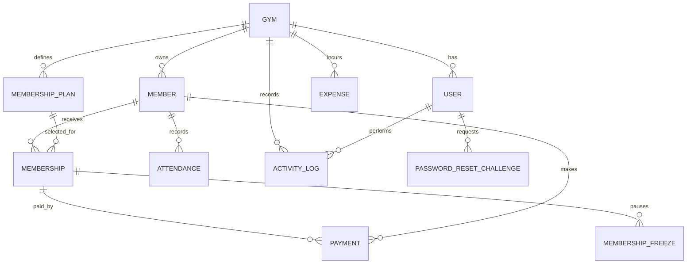
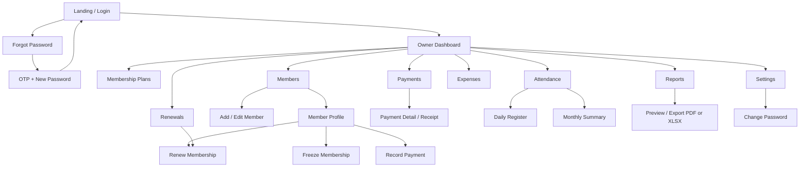
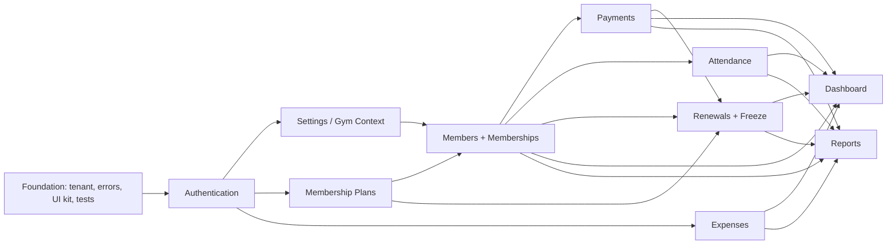

# FitLedger Gym Management SaaS — MVP Product and Architecture Plan

**Document status:** Proposed for approval  
**Version:** 1.0  
**Audience:** Product, design, frontend, backend, QA, and operations  
**Target user:** Gym owner only  
**Current repository:** React 18 + Vite + Tailwind CSS, Node.js + Express, MongoDB + Mongoose  
**Implementation gate:** No implementation work should begin until this plan is approved.

## Decision summary

- Keep the existing MERN stack. Rewriting the working React client in Angular is not justified for this MVP unless Angular is a contractual requirement.
- Preserve strict tenant isolation: every tenant-owned query must be scoped by authenticated `gymId`.
- Introduce `MembershipPlan` and `Membership` as separate records. A member is a person; a membership is a dated commercial agreement and renewal history.
- Record each payment as an immutable transaction against a membership. Store price, discount, final amount, due date, and derived outstanding balance on the membership.
- Derive renewal queues from membership end dates; do not create a redundant renewal collection.
- Use soft deletion for business records and retain historical financial records.
- Ship modules one at a time, including UI, API, persistence, validation, errors, and tests, as required by the brief.
- Treat self-service registration and the marketing page as existing capabilities, not new MVP module work. Only the `owner` role is authorized in V1.

---

# 1. Product Requirement Document (PRD)

## 1.1 Product vision

FitLedger gives a gym owner one fast, trustworthy place to run daily operations: members, plans, money, attendance, renewals, expenses, and reports. The experience should feel calm during a busy front-desk interaction, with the most common actions reachable in one or two steps.

## 1.2 Problem statement

Small and mid-sized gyms often use notebooks, spreadsheets, chat messages, and memory. This causes missed renewals, unclear dues, inconsistent attendance records, slow receipt creation, and no reliable view of profit. FitLedger replaces that fragmented workflow with a tenant-isolated owner dashboard.

## 1.3 Goals

1. Let an owner add or find a member in under 30 seconds.
2. Make current membership status and outstanding dues unambiguous.
3. Surface expiries due today and in the next seven days without manual calculation.
4. Record attendance and payments with minimal input.
5. Provide daily/monthly revenue, expense, and profit figures the owner can trust.
6. Export operational reports in PDF and Excel-compatible XLSX format.
7. Establish a clean, reusable foundation for future trainer and member roles.

## 1.4 Non-goals for V1

- Trainer and member portals or permissions
- Workout, diet, body measurement, lead/CRM, class booking, payroll, inventory, POS, or access-control hardware
- Automated WhatsApp/SMS/email renewal campaigns
- Online payment gateway or recurring billing
- Multiple branches under one gym account
- Tax filing/accounting integrations
- Native mobile applications
- Advanced custom report builder
- Biometric attendance

## 1.5 Persona

**Gym owner:** Operates one gym, may also handle the front desk, has limited time, and needs a quick answer to “who is active, who owes money, who expires soon, and how is the gym performing?” The owner has full V1 access.

## 1.6 Success metrics

| Metric | MVP target |
|---|---:|
| Add-member median completion time | ≤ 30 seconds |
| Record-payment median completion time | ≤ 20 seconds |
| Mark-attendance median completion time | ≤ 5 seconds |
| Core API p95 latency, excluding exports | < 500 ms under expected MVP load |
| Dashboard initial usable render | < 3 seconds on average 4G |
| Tenant data leakage incidents | 0 |
| Successful report exports | ≥ 99% |
| Unhandled server errors in core flows | < 0.5% of requests |

## 1.7 Functional requirements and acceptance criteria

### Authentication

- Owner can log in using email and password; existing phone login may be retained.
- Owner can request a password-reset OTP without revealing whether an account exists.
- OTP expires after 10 minutes, has an attempt limit, and is stored only as a hash.
- Authenticated owner can change password after entering the current password.
- JWT-protected endpoints reject missing, invalid, or expired tokens with `401`.
- All V1 authorization requires role `owner`; tenant context comes from the verified user, never request body/query input.

### Dashboard

- Display total, active, expired, and frozen member counts.
- Display today’s attendance, today’s collected amount, current-month collection, pending amount, upcoming renewals, current-month expense, and current-month profit.
- Monthly revenue, member-growth, and attendance-trend charts support a documented date range.
- Recent sections show today’s new members, today’s payments, and nearest upcoming expiries.
- Clicking a metric navigates to the corresponding pre-filtered module.
- Empty data renders a helpful zero/empty state, not a broken chart.

### Membership plans

- Owner can create, list, view, edit, activate/deactivate, and soft-delete a plan.
- Required fields: unique plan name per gym, duration value/unit, non-negative price, status.
- A plan already used by a membership cannot be hard-deleted.
- Existing memberships retain the price/name snapshot used at purchase even if a plan later changes.

### Members

- Owner can create, view, edit, and soft-delete a member.
- System generates a tenant-unique member ID such as `MEM-000123`.
- Search supports name, normalized mobile number, and exact/partial member ID.
- Filters support active, expired, frozen, and inactive status.
- Profile shows personal details, current membership, payment history, attendance summary, and activity history.
- Optional profile photo is validated for type and size; production storage uses object storage, not MongoDB binary data.
- Renew creates a new membership record; it does not overwrite prior membership history.
- Freeze requires start/end dates and a reason, prevents attendance during the freeze, and extends membership end date by the approved freeze days.
- Delete requires confirmation and performs soft deletion. Historical payments remain available for reporting.

### Payments

- Owner selects a member and open/current membership, enters paid amount, mode, date, and optional reference/note.
- Payment screen shows plan price, discount, final amount, already paid, payment being entered, and pending amount.
- Supported modes: cash, UPI, card, bank.
- Paid amount must be positive and cannot exceed the outstanding amount unless explicit overpayment support is later approved.
- A successful payment receives a tenant-unique receipt number and printable receipt.
- Financial transactions are voided with an audit reason instead of being physically deleted.
- Due date is stored on the membership and appears in pending-payment views.

### Attendance

- Owner can search a member and mark one attendance record per local calendar day.
- Duplicate check-in returns a clear conflict message and does not create another record.
- Daily register supports date, search, status, and pagination.
- Member profile shows attendance history and current-month count.
- Monthly report shows attended days per member and supports export.
- Frozen, inactive, deleted, or membership-expired members cannot be marked present without resolving status first.

### Renewals

- Queues identify expired memberships, memberships expiring today, and memberships expiring within the next seven local calendar days.
- One-click renewal opens a prefilled confirmation/form; owner can change plan, start date, discount, due date, and initial payment.
- Renewal and optional initial payment are committed atomically when MongoDB transaction support is available.
- After renewal, the member’s derived status and dashboard queues update immediately.

### Expenses

- Owner can create, list, edit, and soft-delete expenses.
- Categories: rent, salary, electricity, maintenance, marketing, other.
- Required: category, amount > 0, expense date, description/payee label.
- Dashboard monthly expense is the sum of non-deleted expenses in the gym timezone.
- Profit equals collected revenue minus expenses for the same period. It is cash-basis profit, not accounting net income.

### Reports

- Reports: revenue, expense, member, attendance, pending payment, and membership expiry.
- Each report supports a sensible date range/status filters, pagination, and deterministic sorting.
- Export uses the active filters and includes gym identity, generated timestamp, totals, and row data.
- PDF is for presentation/printing; XLSX is for analysis. Large exports may become asynchronous in a future version.

### Settings

- Owner can edit gym name, logo, address, phone, email, GST number, invoice prefix, timezone, and currency.
- Invoice prefix is uppercase alphanumeric plus `-` or `/`, tenant-unique numbering remains atomic.
- Timezone defaults to `Asia/Kolkata`; currency defaults to `INR`.
- Logo upload validates file type and size.

## 1.8 Shared business rules

- Dates are stored in UTC and interpreted for daily/monthly boundaries using the gym timezone.
- Currency is stored as integer minor units (`paise`) to avoid floating-point errors. API exposes integer minor units plus formatted UI values.
- Member operational status is derived in this order: deleted → inactive → frozen → active if a current membership exists → expired.
- “Upcoming renewal” means current membership end date is after today and on/before today + 7 days.
- “Pending amount” is membership final amount minus sum of successful, non-voided payments.
- All list APIs enforce a maximum page size of 100 and allow only whitelisted sort fields.
- All tenant-owned unique constraints include `gymId`.
- Audit fields are populated from the authenticated user.

## 1.9 Non-functional requirements

- **Security:** bcrypt password hashing, secret rotation readiness, short-lived access token strategy, rate limiting on auth, Helmet/security headers, strict CORS, input sanitization, file validation, and no secrets in logs.
- **Isolation:** every repository/service method requires tenant context; automated cross-tenant tests are release-blocking.
- **Accessibility:** WCAG 2.1 AA intent, keyboard operability, visible focus, semantic labels, sufficient contrast, and non-color-only statuses.
- **Responsiveness:** usable at 360 px width; table-heavy screens switch to cards or controlled horizontal scrolling.
- **Reliability:** centralized error handling, correlation IDs, structured logs, health/readiness endpoints, backups, and idempotency for renewal/payment creation.
- **Maintainability:** feature-based modules, DTO validation, controller/service/repository boundaries, no business logic in React pages or Express route files.
- **Performance:** indexed tenant filters, aggregate only necessary ranges, lazy-load heavy screens, and paginate all unbounded lists.

## 1.10 MVP release criteria

- All module acceptance criteria pass.
- Unit, API integration, and core browser-flow tests pass in CI.
- No critical/high security defects or known tenant-isolation defect.
- Database migration/backfill tested against a copy of current schema data.
- Production environment variables, backup, error monitoring, and rollback steps documented.
- Owner can complete add member → take payment → print receipt → mark attendance → renew → export report end to end.

---

# 2. Complete Database Schema

MongoDB collections use Mongoose. “Foreign key” below means an `ObjectId` reference plus application validation; MongoDB does not enforce relational foreign keys. Tenant-scoped references must resolve to a document with the same `gymId`.

## 2.1 Entity relationship diagram



## 2.2 Shared field conventions

All tenant-owned business collections include:

| Field | Type | Rule |
|---|---|---|
| `gymId` | ObjectId → Gym | Required, immutable, indexed |
| `createdAt`, `updatedAt` | Date | Mongoose timestamps |
| `createdBy`, `updatedBy` | ObjectId → User | Required for authenticated mutations |
| `deletedAt` | Date/null | Null unless soft-deleted |
| `deletedBy` | ObjectId → User/null | Set with `deletedAt` |

Default queries exclude `deletedAt != null`. Financial data uses voiding fields rather than deletion after issuance.

## 2.3 Collections

### `gyms`

| Field | Type | Constraints |
|---|---|---|
| `_id` | ObjectId | Primary identifier |
| `name` | String | Required, 2–120 chars |
| `ownerName` | String | Required, 2–100 chars |
| `email` | String | Required, lowercase |
| `phone` | String | Normalized plus display value |
| `address` | Object | `line1`, `line2`, `city`, `state`, `postalCode`, `country` |
| `logoUrl` | String/null | HTTPS/object-storage URL |
| `gstNumber` | String/null | Uppercase, validated when supplied |
| `invoicePrefix` | String | Default `FL`, 2–12 allowed chars |
| `timezone` | String | IANA name, default `Asia/Kolkata` |
| `currency` | String | ISO 4217, default `INR` |
| `memberSequence` | Number | Atomic member-ID counter |
| `receiptSequence` | Number | Atomic receipt counter |
| `status` | Enum | `trial`, `active`, `suspended` |
| `trialStartsAt`, `trialEndsAt` | Date/null | Existing SaaS trial support |
| audit fields | — | Timestamps; creator nullable only during initial signup |

Indexes: unique `{ email: 1 }`; optional unique sparse `{ phoneNormalized: 1 }` if phone login stays.

### `users`

| Field | Type | Constraints |
|---|---|---|
| `gymId` | ObjectId → Gym | Required |
| `name` | String | Required |
| `email` | String | Required, lowercase |
| `passwordHash` | String | Required, never selected by default |
| `role` | Enum | V1 only `owner` |
| `status` | Enum | `active`, `disabled` |
| `lastLoginAt` | Date/null | Audit/security |
| audit fields | — | Soft delete permitted only when safe |

Indexes: unique `{ email: 1 }`; `{ gymId: 1, role: 1, deletedAt: 1 }`.

### `password_reset_challenges`

| Field | Type | Constraints |
|---|---|---|
| `userId` | ObjectId → User | Required |
| `otpHash` | String | Required |
| `expiresAt` | Date | Required; TTL index |
| `attempts` | Number | Default 0, max 5 |
| `consumedAt` | Date/null | Single use |
| `requestedIpHash` | String/null | Abuse diagnostics without storing raw IP |
| `createdAt` | Date | Required |

Indexes: TTL `{ expiresAt: 1 }` with `expireAfterSeconds: 0`; `{ userId: 1, createdAt: -1 }`.

### `membership_plans`

| Field | Type | Constraints |
|---|---|---|
| `name` | String | Required, 2–80 chars |
| `nameNormalized` | String | Required for uniqueness |
| `durationValue` | Number | Positive integer |
| `durationUnit` | Enum | `day`, `month`, `year` |
| `priceMinor` | Number | Integer ≥ 0 |
| `description` | String | Max 500 |
| `status` | Enum | `active`, `inactive` |
| shared audit fields | — | Soft delete |

Indexes: unique partial `{ gymId: 1, nameNormalized: 1 }` where `deletedAt: null`; `{ gymId: 1, status: 1, deletedAt: 1 }`.

### `members`

| Field | Type | Constraints |
|---|---|---|
| `memberCode` | String | Required, generated and tenant-unique |
| `name` | String | Required, 2–120 chars |
| `phone` / `phoneNormalized` | String | Required; normalized search value |
| `email` | String/null | Lowercase, valid if supplied |
| `gender` | Enum/null | `male`, `female`, `other`, `prefer_not_to_say` |
| `dateOfBirth` | Date/null | Must be in past |
| `address` | Object | Same address shape as Gym; all optional |
| `profilePhotoUrl` | String/null | Object-storage URL |
| `joinDate` | Date | Required |
| `batch` | String/null | Free text in V1 |
| `trainerName` | String/null | Snapshot/free text; no Trainer entity in V1 |
| `lockerNumber` | String/null | Tenant-unique when present |
| `lifecycleStatus` | Enum | `active`, `inactive`; active/expired/frozen is otherwise derived |
| `inactiveReason` | String/null | Required when inactive |
| shared audit fields | — | Soft delete |

Indexes: unique `{ gymId: 1, memberCode: 1 }`; `{ gymId: 1, phoneNormalized: 1, deletedAt: 1 }`; `{ gymId: 1, name: 1, deletedAt: 1 }`; unique partial `{ gymId: 1, lockerNumber: 1 }` for non-null and non-deleted values.

### `memberships`

| Field | Type | Constraints |
|---|---|---|
| `memberId` | ObjectId → Member | Required, same tenant |
| `planId` | ObjectId → MembershipPlan | Required, same tenant |
| `planSnapshot` | Object | Required: `name`, duration, `priceMinor` at sale time |
| `startDate` | Date | Required |
| `endDate` | Date | Required, after/equal start date |
| `originalEndDate` | Date | Required; preserves pre-freeze value |
| `status` | Enum | `scheduled`, `active`, `expired`, `cancelled` |
| `grossAmountMinor` | Number | Plan price snapshot |
| `discountMinor` | Number | Integer ≥ 0 and ≤ gross |
| `finalAmountMinor` | Number | gross − discount |
| `dueDate` | Date/null | Payment due date |
| `notes` | String/null | Max 500 |
| `renewedFromMembershipId` | ObjectId → Membership/null | Renewal lineage |
| shared audit fields | — | Normally not deleted; cancel instead |

Indexes: `{ gymId: 1, memberId: 1, startDate: -1 }`; `{ gymId: 1, status: 1, endDate: 1 }`; `{ gymId: 1, dueDate: 1 }`. Service validation prevents overlapping non-cancelled memberships for the same member unless explicitly allowed later.

### `membership_freezes`

| Field | Type | Constraints |
|---|---|---|
| `membershipId` | ObjectId → Membership | Required |
| `memberId` | ObjectId → Member | Required, denormalized for query speed |
| `startDate`, `endDate` | Date | Required, valid range |
| `extensionDays` | Number | Positive integer, computed consistently |
| `reason` | String | Required, max 300 |
| `cancelledAt`, `cancelledBy` | Date/ObjectId null | Audit cancellation |
| shared audit fields | — | No hard delete |

Indexes: `{ gymId: 1, memberId: 1, startDate: -1 }`; `{ gymId: 1, membershipId: 1 }`. Freeze ranges may not overlap.

### `payments`

| Field | Type | Constraints |
|---|---|---|
| `memberId` | ObjectId → Member | Required, same tenant |
| `membershipId` | ObjectId → Membership | Required, same tenant |
| `receiptNumber` | String | Required, tenant-unique |
| `amountMinor` | Number | Positive integer; actual transaction amount |
| `mode` | Enum | `cash`, `upi`, `card`, `bank` |
| `paidAt` | Date | Required |
| `reference` | String/null | UPI/bank/card reference, max 100 |
| `note` | String/null | Max 500 |
| `idempotencyKey` | String/null | Unique per gym when supplied |
| `status` | Enum | `completed`, `voided` |
| `voidedAt`, `voidedBy`, `voidReason` | mixed/null | Reason required on void |
| shared audit fields | — | Never physically delete issued transactions |

Indexes: unique `{ gymId: 1, receiptNumber: 1 }`; unique sparse `{ gymId: 1, idempotencyKey: 1 }`; `{ gymId: 1, paidAt: -1, status: 1 }`; `{ gymId: 1, membershipId: 1, status: 1 }`; `{ gymId: 1, memberId: 1, paidAt: -1 }`.

### `attendance`

| Field | Type | Constraints |
|---|---|---|
| `memberId` | ObjectId → Member | Required, same tenant |
| `attendanceDate` | String | Local date `YYYY-MM-DD` in gym timezone |
| `checkedInAt` | Date | UTC timestamp |
| `source` | Enum | V1 `manual` |
| `note` | String/null | Max 250 |
| shared audit fields | — | Soft delete only to correct mistakes |

Indexes: unique partial `{ gymId: 1, memberId: 1, attendanceDate: 1 }` where `deletedAt: null`; `{ gymId: 1, attendanceDate: 1, deletedAt: 1 }`.

### `expenses`

| Field | Type | Constraints |
|---|---|---|
| `category` | Enum | `rent`, `salary`, `electricity`, `maintenance`, `marketing`, `other` |
| `amountMinor` | Number | Positive integer |
| `expenseDate` | Date | Required |
| `payee` | String/null | Max 120 |
| `description` | String | Required, max 500 |
| `reference` | String/null | Bill/reference number |
| `attachmentUrl` | String/null | Deferred unless needed; schema-ready |
| shared audit fields | — | Soft delete |

Indexes: `{ gymId: 1, expenseDate: -1, deletedAt: 1 }`; `{ gymId: 1, category: 1, expenseDate: -1, deletedAt: 1 }`.

### `activity_logs`

| Field | Type | Constraints |
|---|---|---|
| `actorUserId` | ObjectId → User | Required |
| `entityType` | Enum | `member`, `membership`, `plan`, `payment`, `attendance`, `expense`, `gym`, `auth` |
| `entityId` | ObjectId/null | Target entity |
| `action` | String | Stable action key |
| `summary` | String | Human-readable, no secrets |
| `changes` | Object/null | Whitelisted before/after fields |
| `requestId` | String/null | Trace correlation |
| `createdAt` | Date | Immutable |

Indexes: `{ gymId: 1, createdAt: -1 }`; `{ gymId: 1, entityType: 1, entityId: 1, createdAt: -1 }`.

## 2.4 Migration from current collections

1. Add shared audit/soft-delete fields and indexes without changing current behavior.
2. Create a default plan for each distinct legacy `planDuration`/price assumption; if legacy price is unavailable, mark it for owner review.
3. Create one historical/current membership per existing member using `joiningDate`, `expiryDate`, and duration.
4. Link legacy payments to the best matching membership; unresolved records go to an explicit migration review report.
5. Convert rupee decimal values to integer paise with a logged, idempotent migration.
6. Rename legacy API fields through backward-compatible mapping for one release, then remove aliases.
7. Verify counts and financial totals before/after migration per gym.

---

# 3. Target Folder Structure

The repository stays a modular monolith. Feature boundaries are explicit without premature microservices.

```text
fitledger-MERN/
├── docs/
│   ├── MVP_PRODUCT_ARCHITECTURE_PLAN.md
│   └── decisions/
├── client/
│   └── src/
│       ├── app/
│       │   ├── App.jsx
│       │   ├── router.jsx
│       │   └── providers.jsx
│       ├── assets/
│       ├── components/
│       │   ├── ui/                 # Button, Input, Modal, Table, Skeleton
│       │   └── layout/             # Sidebar, Topbar, Breadcrumb
│       ├── features/
│       │   ├── auth/
│       │   ├── dashboard/
│       │   ├── plans/
│       │   ├── members/
│       │   ├── payments/
│       │   ├── attendance/
│       │   ├── renewals/
│       │   ├── expenses/
│       │   ├── reports/
│       │   └── settings/
│       │       ├── api/
│       │       ├── components/
│       │       ├── hooks/
│       │       ├── pages/
│       │       ├── schemas/
│       │       └── types/
│       ├── hooks/
│       ├── lib/                    # API client, date, money, upload helpers
│       ├── styles/
│       └── test/
├── server/
│   └── src/
│       ├── app.js
│       ├── server.js
│       ├── config/
│       ├── common/
│       │   ├── errors/
│       │   ├── middleware/
│       │   ├── pagination/
│       │   ├── security/
│       │   └── validation/
│       ├── modules/
│       │   ├── auth/
│       │   ├── dashboard/
│       │   ├── plans/
│       │   ├── members/
│       │   ├── memberships/
│       │   ├── payments/
│       │   ├── attendance/
│       │   ├── expenses/
│       │   ├── reports/
│       │   ├── settings/
│       │   └── activity/
│       │       ├── *.routes.js
│       │       ├── *.controller.js
│       │       ├── *.service.js
│       │       ├── *.repository.js
│       │       ├── *.model.js
│       │       ├── *.validation.js
│       │       └── *.test.js
│       ├── jobs/                   # status reconciliation/cleanup only
│       └── test/
├── scripts/
│   └── migrations/
└── package.json
```

Rules: route → validation/auth middleware → controller → service/use case → repository/model. Controllers translate HTTP only. Services own transactions and business rules. Repositories always require `gymId`. React pages compose feature components; API calls and validation do not live directly in pages.

---

# 4. REST API Documentation

## 4.1 Conventions

- Base path: `/api/v1`
- Auth: `Authorization: Bearer <token>` except login/reset endpoints.
- JSON request/response; export endpoints return file streams.
- Dates/times: ISO 8601 UTC; local-date parameters use `YYYY-MM-DD`.
- Money: integer minor units, fields ending in `Minor`.
- Pagination: `page=1&limit=20`; response metadata includes `page`, `limit`, `total`, `totalPages`.
- Sorting: `sort=field:asc|desc`, whitelisted per endpoint.
- Common success envelope: `{ "success": true, "data": ..., "meta": ... }`.
- Common error envelope: `{ "success": false, "error": { "code": "VALIDATION_ERROR", "message": "...", "fields": [] }, "requestId": "..." }`.
- Statuses: `200` read/update, `201` create, `204` successful no-body delete, `400` malformed, `401` unauthenticated, `403` unauthorized, `404` absent in tenant, `409` conflict/duplicate, `422` valid syntax but invalid business rule, `429` rate limited, `500` unexpected.
- All mutation endpoints accept optional `Idempotency-Key`; it is required for payment and renewal creation.

## 4.2 Endpoint catalogue

### Auth and profile

| Method | Path | Purpose | Key request/response |
|---|---|---|---|
| POST | `/auth/login` | Owner login | `{ identifier, password }` → token + owner/gym summary |
| POST | `/auth/forgot-password` | Request OTP | `{ email }` → generic accepted message |
| POST | `/auth/reset-password` | Consume OTP | `{ email, otp, newPassword }` |
| POST | `/auth/change-password` | Authenticated change | `{ currentPassword, newPassword }` |
| GET | `/auth/me` | Current owner/gym | owner, role, gym, preferences |
| POST | `/auth/logout` | Client/session cleanup hook | `204`; useful if refresh tokens are introduced |

Existing `/auth/register` may remain for current SaaS onboarding, but expanding onboarding is outside this module’s MVP scope.

### Dashboard

| Method | Path | Query | Returns |
|---|---|---|---|
| GET | `/dashboard/summary` | `date` optional | All KPI cards in one consistent snapshot |
| GET | `/dashboard/revenue-trend` | `from,to,interval` | Collected revenue series |
| GET | `/dashboard/member-growth` | `from,to,interval` | New member series |
| GET | `/dashboard/attendance-trend` | `from,to,interval` | Attendance series |
| GET | `/dashboard/recent-activity` | `limit` | New members, payments, expiries/activity |

### Membership plans

| Method | Path | Purpose |
|---|---|---|
| GET | `/membership-plans` | List/search/filter/sort/paginate plans |
| POST | `/membership-plans` | Create plan |
| GET | `/membership-plans/:planId` | Get plan |
| PATCH | `/membership-plans/:planId` | Partial update |
| DELETE | `/membership-plans/:planId` | Soft-delete after dependency checks |

Create body: `{ name, durationValue, durationUnit, priceMinor, description, status }`.

### Members and memberships

| Method | Path | Purpose |
|---|---|---|
| GET | `/members` | `search,status,planId,page,limit,sort` list |
| POST | `/members` | Create member; optional initial membership/payment transaction |
| GET | `/members/:memberId` | Full member profile summary |
| PATCH | `/members/:memberId` | Update personal/gym fields |
| DELETE | `/members/:memberId` | Soft-delete with confirmation reason |
| GET | `/members/:memberId/memberships` | Membership/renewal history |
| POST | `/members/:memberId/renewals` | Create renewal, optional initial payment |
| POST | `/members/:memberId/freezes` | Freeze current membership |
| DELETE | `/members/:memberId/freezes/:freezeId` | Cancel future/current freeze safely |
| GET | `/members/:memberId/activity` | Audit activity timeline |
| POST | `/members/:memberId/photo` | Validated image upload; returns URL |

Member body: `{ name, phone, email?, gender?, dateOfBirth?, address?, joinDate, batch?, trainerName?, lockerNumber?, lifecycleStatus? }`.

Renewal body: `{ planId, startDate, discountMinor, dueDate?, notes?, initialPayment?: { amountMinor, mode, paidAt, reference? } }`.

Freeze body: `{ startDate, endDate, reason }`.

### Payments

| Method | Path | Purpose |
|---|---|---|
| GET | `/payments` | Search/filter by member, mode, status, date range |
| POST | `/payments` | Record a payment transaction |
| GET | `/payments/:paymentId` | Payment detail |
| POST | `/payments/:paymentId/void` | Void with `{ reason }` |
| GET | `/payments/:paymentId/receipt` | Printable receipt data or `format=pdf` |
| GET | `/members/:memberId/payments` | Member payment history |

Create body: `{ memberId, membershipId, amountMinor, mode, paidAt, reference?, note? }`. Response includes receipt number and updated membership balance.

### Attendance

| Method | Path | Purpose |
|---|---|---|
| GET | `/attendance` | Daily register by `date`, search, pagination |
| POST | `/attendance` | Mark `{ memberId, checkedInAt?, note? }` |
| DELETE | `/attendance/:attendanceId` | Soft-delete mistaken entry with reason |
| GET | `/members/:memberId/attendance` | Member history by date range |
| GET | `/attendance/monthly-summary` | Monthly counts by member |

### Renewals queue

| Method | Path | Purpose |
|---|---|---|
| GET | `/renewals` | `bucket=expired|today|next7days`, search, page |
| GET | `/renewals/summary` | Counts for each bucket |

Renewal mutation remains under member to express ownership and avoid a fake Renewal resource.

### Expenses

| Method | Path | Purpose |
|---|---|---|
| GET | `/expenses` | Filter by dates/category, paginate/sort |
| POST | `/expenses` | Create expense |
| GET | `/expenses/:expenseId` | Get detail |
| PATCH | `/expenses/:expenseId` | Update expense |
| DELETE | `/expenses/:expenseId` | Soft-delete with reason |
| GET | `/expenses/summary` | Period total and category split |

Body: `{ category, amountMinor, expenseDate, payee?, description, reference? }`.

### Reports and exports

| Method | Path | Purpose |
|---|---|---|
| GET | `/reports/revenue` | Revenue rows/totals |
| GET | `/reports/expenses` | Expense rows/totals |
| GET | `/reports/members` | Member rows/counts |
| GET | `/reports/attendance` | Attendance rows/counts |
| GET | `/reports/pending-payments` | Open balances/aging |
| GET | `/reports/membership-expiry` | Expiry rows/buckets |
| GET | `/reports/:reportType/export` | `format=pdf|xlsx` with same filters |

### Settings

| Method | Path | Purpose |
|---|---|---|
| GET | `/settings/gym` | Gym profile/preferences |
| PATCH | `/settings/gym` | Update text settings |
| POST | `/settings/gym/logo` | Validated logo upload |
| DELETE | `/settings/gym/logo` | Remove logo reference |

## 4.3 Validation examples

- Invalid field shape → `400 VALIDATION_ERROR` with field paths.
- Duplicate plan name/member code/daily attendance → `409 RESOURCE_CONFLICT`.
- Payment above outstanding balance → `422 PAYMENT_EXCEEDS_BALANCE`.
- Attendance for frozen/expired member → `422 MEMBER_NOT_ELIGIBLE_FOR_ATTENDANCE`.
- Cross-tenant ID behaves as not found (`404`), never confirms another tenant’s record.

---

# 5. Screen Flow



Primary navigation order: Dashboard, Members, Plans, Payments, Attendance, Renewals, Expenses, Reports, Settings. “Add payment” is a contextual action, not a permanent primary navigation item.

---

# 6. User Flows

## 6.1 First daily check

Login → Dashboard → scan today’s attendance/collection and renewal alerts → click a KPI/alert → arrive at pre-filtered list → take action → toast confirms → metric refreshes.

## 6.2 Add member with initial membership and payment

Members → Add member → enter personal/gym details → select active plan → system previews dates and price → optionally enter discount, due date, and initial payment → review → submit → transactional creation → member profile with receipt action.

Failure behavior: field errors remain inline; duplicate phone warns but does not necessarily block if gym policy allows duplicates; failed payment prevents partial creation when submitted as one transaction.

## 6.3 Find and update member

Members → search name/mobile/member ID → filter status → open profile → Edit → validate/save → activity entry added → updated profile shown.

## 6.4 Record payment

Payments or Member Profile → Record payment → select member/open membership → view total/paid/pending → enter amount/mode/reference → confirm → receipt generated → print/download receipt.

## 6.5 Mark attendance

Attendance → today defaults active → search member → Mark present → immediate success state. If already marked, show time of prior check-in. If ineligible, show reason plus relevant action link.

## 6.6 Renewal

Dashboard/Renewals/Member Profile → choose expiring member → Renew → prefilled current plan and next valid start date → optionally change plan/discount/due date/payment → confirm → new membership and payment created → status/queue updated.

## 6.7 Freeze

Member Profile → Freeze → choose range and reason → show extension preview → confirm → freeze record created → member displays frozen during range and adjusted expiry.

## 6.8 Expense and profit

Expenses → Add expense → select category/date → enter amount/details → save → list and monthly totals refresh → Dashboard profit reflects the same period definition.

## 6.9 Report export

Reports → choose report → set date/status/category filters → Preview → verify totals → Export PDF or XLSX → file includes active filters and generated timestamp.

---

# 7. UI Wireframe Description

## 7.1 Design language

- Premium but restrained: neutral slate surfaces, one energetic brand accent, semantic success/warning/danger colors.
- 8 px spacing grid; 12–16 px card radius; low-elevation soft shadows; strong text hierarchy.
- Typography: modern system/inter-style sans serif; tabular numerals for amounts.
- Light theme ships in MVP with tokenized dark-mode readiness. Full dark-mode QA is not a release requirement unless approved.
- Minimum touch target 44 × 44 px; visible focus rings; reduced-motion support.

## 7.2 Application shell

Desktop: 240–264 px collapsible left sidebar, sticky top bar, breadcrumb/title row, scrollable content. Mobile: sidebar becomes an off-canvas drawer with backdrop; top bar contains menu, page title, and compact owner menu. Main content width is fluid with 24 px desktop and 16 px mobile gutters.

## 7.3 Dashboard

Top row: page title, current date context, optional refresh. KPI grid uses 4 columns desktop, 2 tablet, 1 mobile. First row prioritizes total/active/expired members and today attendance; second prioritizes today/month collection, pending, upcoming renewals; financial strip includes expense and profit.

Charts: revenue spans two columns; member growth and attendance trend share the next row. Bottom uses three concise tables/cards: today’s new members, today’s payments, upcoming expiry. Every card has loading skeleton, empty state, error/retry state, and a contextual link.

## 7.4 List screens

Header: breadcrumb, title/count, primary action. Toolbar: debounced search, filter chips/dropdowns, date range where relevant, and export if applicable. Desktop data table has sortable headers, sticky action column, status pills, and pagination. Mobile uses stacked cards showing only decision-critical fields with an overflow menu.

## 7.5 Forms

Desktop add/edit flows use a right-side drawer for short forms (plan, expense) and a full page/two-column form for member creation. Required markers and helper text are consistent. Validation appears below fields and an error summary focuses the first invalid input. Destructive changes use a confirmation dialog that names the impact.

## 7.6 Member profile

Header shows photo/initials, member code, name, status, mobile, and actions: Renew, Record payment, More. Summary cards show current plan, expiry, pending amount, and attendance this month. Tabs: Overview, Memberships, Payments, Attendance, Activity. On mobile, tabs horizontally scroll and actions collapse into a bottom-safe menu.

## 7.7 Attendance

Large search input optimized for front desk, date selector, and “present today” count. Eligible search results expose a single high-confidence Mark Present action. Daily register follows below. Success feedback updates the row without a full reload.

## 7.8 Renewals

Three count tabs: Expired, Today, Next 7 Days. Rows/cards show member, phone, plan, expiry date, due balance, and Renew action. Renewal drawer shows old/new dates and price calculation before confirmation.

## 7.9 Payments and receipt

Payment form keeps balance calculation visible in a sticky summary card. Receipt is an A4-friendly printable layout with gym identity, GST (if set), receipt number, member/member ID, plan period, amount/mode/reference/date, and owner/gym signature label. No unnecessary decorative ink-heavy background.

## 7.10 System states

- Skeletons match final layout to reduce shift.
- Empty states explain why and offer one primary action.
- Inline retry for local failures; full-page error only when the page cannot function.
- Toasts confirm completed actions; they never carry critical instructions that disappear.
- Unsaved-change prompt protects long member forms.

---

# 8. Development Roadmap

Each numbered module is a release-quality vertical slice: schema/migration, API, UI, validation, error handling, unit/integration/browser tests, and documentation. Work does not move to the next module until its definition of done passes.

| Phase | Module | Deliverable and exit condition |
|---:|---|---|
| 0 | Foundation | Feature structure, design tokens/components, API envelope, tenant repository guard, validation/error middleware, test harness, CI. Existing smoke tests pass. |
| 1 | Authentication | Login, forgot/reset, change password, owner-only authorization, rate limits and auth tests. |
| 2 | Membership Plans | Full plan CRUD/status/soft delete and responsive list/forms; dependency rules tested. |
| 3 | Members + Membership Core | Expanded member data, generated ID, member CRUD/profile/search/filter, initial membership, migration/backfill; tenant and date rules tested. |
| 4 | Payments | Membership pricing/dues, partial payments, modes, immutable receipt/void, history, printable receipt; totals reconciled in tests. |
| 5 | Attendance | Manual daily attendance, duplicate prevention, history/monthly summary and states; timezone tests pass. |
| 6 | Renewals + Freeze | Derived buckets, one-click transactional renewal, freeze/extension, profile/dashboard links; boundary-date tests pass. |
| 7 | Expenses | CRUD/categories/soft delete, summaries, dashboard-ready aggregates; money/date tests pass. |
| 8 | Dashboard | Unified KPI endpoint, all charts/recent lists, links and loading/empty/error states; figures reconcile to source modules. |
| 9 | Reports | Six report previews plus PDF/XLSX export; filters/totals/export parity tested. |
| 10 | Settings | Gym data/logo/GST/prefix/timezone/currency plus upload/security tests. |
| 11 | Release hardening | Accessibility/responsive pass, performance/index review, security/tenant audit, migration rehearsal, backup/rollback, observability, UAT. |

## Definition of done for every module

- Approved acceptance criteria and responsive UI complete.
- API contract and schema documented.
- Server-side validation and centralized errors complete; client validation mirrors but never replaces server validation.
- Tenant scope and authorization covered by negative tests.
- Unit tests for business rules, API integration tests for success/failure, and browser test for primary flow.
- Loading, empty, error, confirmation, and success feedback implemented.
- No lint/build/test regressions; indexes reviewed for new query patterns.

---

# 9. Module Dependency Diagram



Cross-cutting dependencies: audit logging observes every mutation; timezone and money utilities are shared; exports read through report services rather than duplicating query logic; all modules depend on tenant/auth context.

---

# 10. Future Scalability Plan

## 10.1 Near-term technical scale

- Keep a modular monolith until measured load or team ownership warrants separation.
- Make Express instances stateless; store uploaded assets in S3-compatible object storage and deploy multiple instances behind a load balancer.
- Add Redis only when needed for refresh-token/session revocation, rate limiting, caching stable aggregates, or background jobs.
- Precompute dashboard summaries only after aggregation latency is measured; invalidate by gym and affected date range.
- Move large PDF/XLSX generation to a queue/worker with downloadable job status when synchronous exports approach platform timeouts.
- Use MongoDB replica sets for production transactions, backups, and failover. Monitor index usage and slow queries.

## 10.2 Product expansion boundaries

- **Staff/trainers:** add role/permission tables and gym invitations; do not overload the owner role.
- **Members:** separate member identity/login from the operational Member record; introduce consent and privacy controls.
- **Multiple branches:** add `organizationId` and `branchId`, with memberships and attendance branch-aware; migrate tenant keys deliberately.
- **Online payments:** add payment intents/provider events and webhook idempotency; retain internal Payment as the settled ledger record.
- **Notifications:** domain events feed SMS/WhatsApp/email workers with templates, consent, retries, and delivery logs.
- **Access hardware:** attendance ingestion API uses device credentials and idempotency without changing manual attendance semantics.
- **Accounting:** introduce immutable journal/invoice concepts before claiming accrual profit or tax compliance.

## 10.3 Security and compliance growth

- Refresh-token rotation and device/session management if longer sessions are needed.
- Field-level encryption for sensitive data as risk/compliance demands.
- Tenant-aware retention/export/delete workflows and documented privacy policy.
- Centralized secrets manager, dependency scanning, SAST, audit log retention, incident response, and periodic restore tests.

## 10.4 Observability and operations

- Structured JSON logs with request ID, route, status, duration, gym ID hash, and error code; never log passwords, OTPs, tokens, or full personal data.
- Metrics: request latency/error rate, Mongo latency, queue depth, export duration, auth failures, renewal/payment conflicts.
- Alerts tied to user impact and runbooks. Health endpoint is separate from dependency-aware readiness.
- Feature flags for risky migrations and staged rollout; backward-compatible API/schema changes during deploys.

## 10.5 Architecture decision triggers

Extract a service only when at least one condition is measured: independent scaling is materially cheaper, failure isolation is necessary, deployment cadence conflicts across teams, or domain ownership is stable. Reports/exports and notifications are likely first worker boundaries; authentication should use a proven provider only if product requirements outgrow the in-house owner-only flow.

---

# Approval Checklist

Approval authorizes implementation beginning with Phase 0, then one module at a time. Please explicitly approve or amend these decisions:

1. Retain React/MERN instead of rewriting the client in Angular.
2. Use Membership as the historical plan/renewal/billing agreement.
3. Use integer paise for all persisted monetary values.
4. Use cash-basis profit: collected payments minus expenses.
5. Default gym timezone/currency to `Asia/Kolkata` and `INR`.
6. Keep trainer as optional text in V1; no Trainer module.
7. Keep existing self-registration available but do not expand onboarding scope.
8. Treat full dark mode as readiness, not an MVP release requirement.

Once approved, implementation should start with **Phase 0: Foundation** only.
